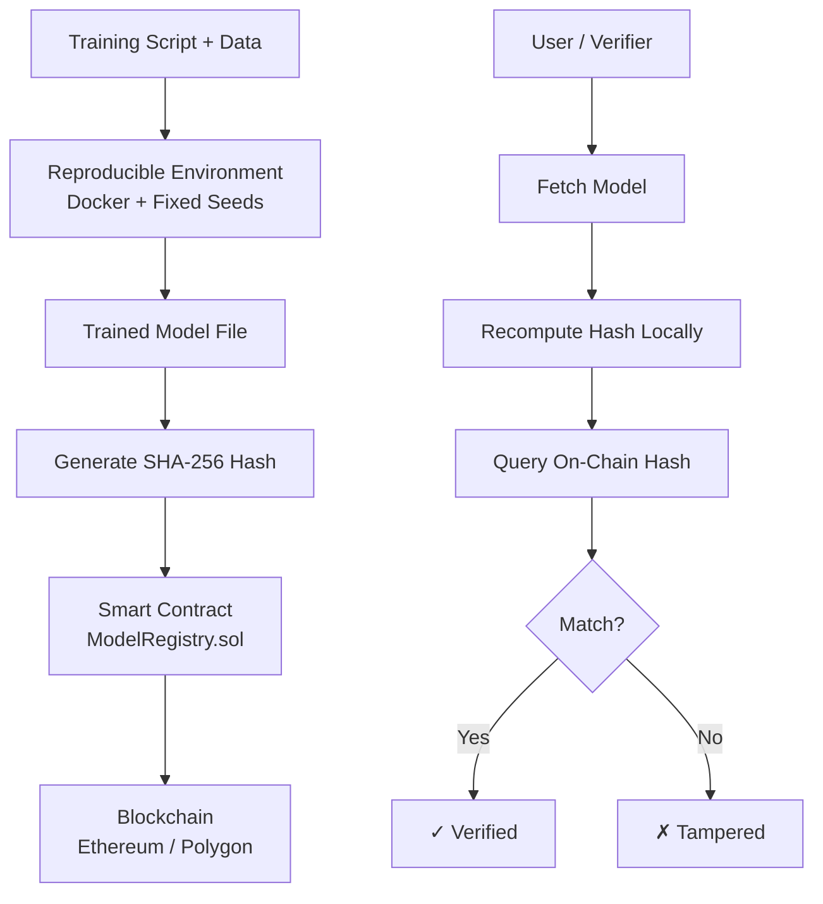

Here are the remaining documentation files for your project. I've included the full content for each, building on the existing api-reference.md and cloud-deployment.md we already created.

---

docs/index.md – Project Landing Page

```markdown
# Blockchain‑Verifiable Reproducible ML Models

[](https://python.org)
[](https://soliditylang.org)
[](https://opensource.org/licenses/MIT)
[](https://github.com/Gitdigital-products)

A complete system for creating **machine learning models with cryptographic proof of reproducibility**.  
Every model’s hash is registered on the blockchain (Ethereum/Polygon) to provide tamper‑proof provenance and version lineage.

Built as part of the **GitDigital Products** ecosystem, this project combines deterministic training, on‑chain verification, and scalable cloud deployment.

---

## ✨ Key Features

| Feature | Description |
|---------|-------------|
| **🔁 Deterministic Reproducibility** | Train models that can be identically reproduced using containerized environments (Docker) and fixed random seeds. |
| **🔗 On‑Chain Verification** | Register model hashes on Ethereum/Polygon via Solidity smart contracts for immutable proof of integrity. |
| **📈 Full Lineage Tracking** | Version and trace models through their entire lifecycle—from training to deployment. |
| **🧠 Framework Agnostic** | Supports TensorFlow, PyTorch, XGBoost, and more. Easily extendable. |
| **☁️ Multi‑Cloud Ready** | Deploy the verification API on AWS using Terraform; adaptable to Azure/GCP. |
| **🌐 REST API** | Serve, register, and verify models via a FastAPI‑based interface. |

---

## 🚀 Quick Start

```bash
# 1. Clone the repository
git clone https://github.com/Gitdigital-products/Blockchain-verifiable-reproducible-ML-modelsSystem-Architecture.git
cd Blockchain-verifiable-reproducible-ML-modelsSystem-Architecture

# 2. Install dependencies
pip install -r requirements.txt

# 3. Configure environment
cp .env.example .env
# Edit .env with your blockchain RPC URL and other settings

# 4. Train and register your first model
python model_training/train.py --dataset iris --model-name my_first_model
```

➡️ Full Getting Started Guide

---

📖 Documentation

· Getting Started – Installation, configuration, first run.
· Architecture – System components and data flow.
· Core Concepts – Reproducibility, hashing, blockchain proof.
· Guides
  · Training Models – Using TensorFlow, XGBoost, etc.
  · Blockchain Registration – Registering models on‑chain.
  · Verification – Verifying model integrity.
· API Reference – Complete REST API documentation.
· Deployment
  · Docker – Using Docker for reproducibility.
  · Cloud Deployment (AWS) – Terraform instructions.
· Contributing – How to contribute to GitDigital Products.

---

🧩 Repository Structure

```
.
├── api/                      # FastAPI application
├── blockchain/               # Solidity smart contracts & web3 integration
├── deployment/               # Infrastructure as Code (Terraform, Docker)
├── ml_frameworks/            # Framework‑specific trainers (TF, XGBoost, PyTorch)
├── model_training/           # Core training logic & versioning
├── .env.example              # Example environment variables
├── config.yaml               # Multi‑cloud / multi‑chain configuration
├── docker-compose.yml        # Local development with Docker
└── requirements.txt          # Python dependencies
```

---

🤝 Community & Contributing

We welcome contributions! Please read our Contributing Guidelines and Code of Conduct.

---

📄 License

This project is licensed under the MIT License – see the LICENSE file for details.

```

---

## `docs/getting-started.md`

```markdown
# Getting Started

This guide will help you set up the project locally, train your first verifiable model, and register its hash on a test blockchain.

## Prerequisites

- **Python 3.10+** – Check with `python --version`.
- **pip** – Python package manager.
- **Docker** (optional but recommended) – For fully reproducible environments.
- **Ethereum or Polygon node URL** – For blockchain registration. You can use a public RPC (e.g., `https://polygon-rpc.com`) or a service like Infura.

---

## 1. Clone the Repository

```bash
git clone https://github.com/Gitdigital-products/Blockchain-verifiable-reproducible-ML-modelsSystem-Architecture.git
cd Blockchain-verifiable-reproducible-ML-modelsSystem-Architecture
```

---

2. Set Up Environment Variables

Copy the example environment file and edit it with your settings:

```bash
cp .env.example .env
```

Key variables to set:

· BLOCKCHAIN_RPC_URL – Your Ethereum/Polygon RPC endpoint.
· PRIVATE_KEY – Private key of the account that will register models (for on‑chain transactions). Keep this secret!
· CONTRACT_ADDRESS – Address of the deployed ModelRegistry contract (if you have one). If not, you can deploy a new contract (see Blockchain Registration).

---

3. Install Dependencies

```bash
pip install -r requirements.txt
```

For optional framework support (TensorFlow, PyTorch, XGBoost), install the corresponding extras (see requirements.txt for details).

---

4. (Optional) Run the Setup Script

The setup.sh script creates necessary directories and verifies your environment:

```bash
./setup.sh
```

---

5. Train a Model and Register It

Use the training script with a built‑in dataset:

```bash
python model_training/train.py --dataset iris --model-name my_iris_model
```

This will:

· Train a classifier on the Iris dataset.
· Generate a cryptographic hash (SHA‑256) of the trained model file.
· Register the hash on the configured blockchain (if PRIVATE_KEY is provided).
· Save the model locally in models/ and output the transaction hash.

Example output:

```
Model saved to models/my_iris_model_20250228_123456.h5
Model hash: sha256:e3b0c44298fc1c149afbf4c8996fb92427ae41e4649b934ca495991b7852b855
Registering on blockchain...
Transaction hash: 0xabcdef1234567890...
Registration complete. Model ID: 0x7d7b...3f6a
```

---

6. Verify the Model

You can verify the model against the blockchain hash using the API or the CLI tool:

```bash
python model_training/verify.py --model-file models/my_iris_model_20250228_123456.h5
```

Expected output:

```
Verification successful! Model matches on‑chain record.
```

---

7. Start the API Server (Optional)

To serve your models via REST API:

```bash
uvicorn api.app:app --reload
```

Then visit http://localhost:8000/docs for interactive API documentation.

---

Next Steps

· Explore the Architecture to understand how components interact.
· Learn about Core Concepts like reproducibility and hashing.
· Try training with your own dataset or a different framework (see Training Models).
· Deploy the system to the cloud using our Terraform scripts.

```

---

## `docs/architecture.md`

```markdown
# System Architecture

The system is designed to create a verifiable link between a machine learning model and a public, immutable record on a blockchain.

## High‑Level Workflow



Core Components

1. Training Module (model_training/)

· Handles model training with deterministic settings:
  · Fixed random seeds (Python, NumPy, framework seeds).
  · Dependency versions pinned in requirements.txt.
  · Optional Docker container for full OS‑level reproducibility.
· Supports multiple datasets (built‑in Iris, or custom CSV).
· After training, computes a SHA‑256 hash of the model file and metadata.

2. Blockchain Layer (blockchain/)

· Smart Contract (ModelRegistry.sol):
  · Stores (modelId, owner, hash, timestamp, version, metadataURI).
  · Emits events for registration and updates.
· Web3 Integration (web3_client.py):
  · Uses web3.py to interact with the contract.
  · Handles transaction signing and gas estimation.

3. Verification API (api/)

· FastAPI application exposing REST endpoints.
· Endpoints:
  · POST /models/register – Upload model, compute hash, register on‑chain.
  · POST /models/verify – Upload model, compare hash against on‑chain record.
  · GET /models/{model_id} – Retrieve model metadata.
· Integrates with the blockchain layer and local database (SQLite/Postgres) for caching.

4. Infrastructure as Code (deployment/terraform/)

· AWS:
  · VPC with public/private subnets.
  · ECS Fargate cluster running the API.
  · RDS (PostgreSQL) for metadata storage.
  · Application Load Balancer for HTTPS.
  · CloudWatch for logging/monitoring.
· Easily adaptable to other cloud providers.

5. Framework Adapters (ml_frameworks/)

· Each supported ML framework has a trainer class that implements a common interface:
  · train(dataset, params) -> model
  · save_model(path)
  · load_model(path)
· Currently supported: TensorFlow, PyTorch, XGBoost.

Data Flow for Registration

1. User calls training script with --register flag.
2. Trainer trains model → saves to disk.
3. Hash generator computes SHA‑256 of model file + metadata.
4. Blockchain client sends transaction to registerModel(hash, metadataURI).
5. Contract emits event; transaction receipt returned to user.
6. Model metadata (including on‑chain tx hash) stored locally in models/registry.json.

Security Considerations

· Private keys are never hardcoded; they are read from environment variables or AWS Secrets Manager.
· API authentication via API keys for registration endpoints (verification is public).
· Smart contract access control: Only the contract owner can modify certain parameters; model registration can be open or restricted.
· Data integrity: Model files themselves are not stored on‑chain (too large); only their hashes are.

Extending the System

· Add a new ML framework: Implement a trainer in ml_frameworks/<framework>/ following the existing pattern.
· Add another blockchain: Extend blockchain/ with a new client class (e.g., for Solana).
· Add another cloud provider: Create a new Terraform module in deployment/terraform/.

For detailed API specifications, see API Reference. For deployment instructions, see Cloud Deployment.

```

---

## `docs/core-concepts.md`

```markdown
# Core Concepts

This document explains the fundamental ideas behind the project: reproducibility, cryptographic hashing, and blockchain verification.

## 1. Reproducibility in Machine Learning

A training run is **reproducible** if, given the same code, data, and environment, it produces exactly the same model. This is essential for:
- Auditing and compliance.
- Debugging and iterative improvement.
- Trust in the model’s provenance.

### How We Achieve Reproducibility

- **Deterministic Algorithms**: Use framework features that guarantee deterministic execution (e.g., TensorFlow’s `tf.config.experimental.enable_op_determinism()`).
- **Fixed Random Seeds**: Set seeds for Python, NumPy, and the ML framework before training.
- **Environment Pinning**: All dependencies are pinned to exact versions in `requirements.txt`. For full OS‑level control, we provide a `Dockerfile`.
- **Data Versioning**: The training script records a hash of the dataset (if static) or a reference to a dataset version.

> ⚠️ **Note**: Not all operations can be made deterministic on GPUs due to hardware parallelism. For maximum reproducibility, use CPUs or specific GPU configurations.

---

## 2. Cryptographic Hashing

A **cryptographic hash function** (like SHA‑256) takes an input (e.g., a model file) and produces a fixed‑size string (the hash). Properties:
- **Deterministic**: Same input always yields the same hash.
- **One‑way**: Infeasible to reverse the hash to find the input.
- **Collision‑resistant**: Extremely unlikely that two different inputs produce the same hash.

In this system, we hash the model file **along with metadata** (training timestamp, framework version, dataset hash) to create a unique fingerprint.

Example hash:  
`sha256:e3b0c44298fc1c149afbf4c8996fb92427ae41e4649b934ca495991b7852b855`

---

## 3. Blockchain as an Immutable Ledger

A blockchain is a distributed, tamper‑evident ledger. Once data is recorded in a block, it cannot be altered without changing all subsequent blocks—which is computationally infeasible.

We use a **smart contract** on Ethereum/Polygon to store model hashes. The contract provides:
- **Immutability**: Hashes cannot be changed after registration.
- **Timestamping**: Each registration includes a block timestamp, proving when the model existed.
- **Ownership & Lineage**: The contract can track versions and who registered them.

### Why Not Just Store Hashes in a Database?

A traditional database can be altered by an administrator. Blockchain provides **decentralized trust**—anyone can independently verify the hash without relying on a central authority.

---

## 4. Model Versioning and Lineage

Each registered model gets a unique **model ID** (derived from its hash and owner). When you train a new version of a model, you can:
- Register it as a new entry (independent).
- Link it to a previous version using a `parentId` field in the contract.

This creates a **lineage graph** that can be traced back to the original model.

---

## 5. Verification Process

To verify a model:

1. The user provides the model file and its claimed model ID.
2. The system recomputes the hash of the file (using the same algorithm and metadata schema).
3. It queries the blockchain for the hash stored under that model ID.
4. If the recomputed hash matches the on‑chain hash, the model is **verified**; otherwise, it has been tampered with or the ID is incorrect.

Verification can be done via the API, CLI, or directly by calling the smart contract.

---

## 6. Trust Model

- **You trust the blockchain** (Ethereum/Polygon) to maintain an immutable record.
- **You trust the code** (open source) to compute hashes correctly.
- **You do not need to trust the model provider**—anyone can verify the hash independently.

---

## Next Steps

- See [Training Models](guides/training-models.md) for practical examples.
- Dive into [Blockchain Registration](guides/blockchain-registration.md) to understand the smart contract interaction.
- Read the [API Reference](api-reference.md) to integrate verification into your applications.
```

---

docs/guides/training-models.md

```markdown
# Training Models

This guide covers how to train models using different frameworks and ensure reproducibility.

## Overview

The training pipeline is designed to be framework‑agnostic. Each supported framework has its own trainer class in `ml_frameworks/`. The main entry point is `model_training/train.py`, which accepts command‑line arguments to select the framework, dataset, and hyperparameters.

## Common Options

All trainers support these common arguments:

| Argument | Description | Default |
|----------|-------------|---------|
| `--dataset` | Dataset name (e.g., `iris`, `mnist`) or path to CSV | `iris` |
| `--model-name` | Base name for the saved model | `model` |
| `--framework` | ML framework to use (`tensorflow`, `pytorch`, `xgboost`) | auto‑detected |
| `--epochs` | Number of training epochs | 10 |
| `--batch-size` | Batch size | 32 |
| `--seed` | Random seed for reproducibility | 42 |
| `--no-register` | Skip blockchain registration | `False` |

---

## Training with TensorFlow

The TensorFlow trainer (`ml_frameworks/tensorflow/trainer.py`) builds a simple neural network.

**Example:**
```bash
python model_training/train.py --framework tensorflow --dataset mnist --epochs 5 --model-name tf_mnist
```

This will:

· Load MNIST (if available) or use a synthetic dataset.
· Train a CNN.
· Save the model as an .h5 file.
· Compute its hash and register on the blockchain (if configured).

Customization:
You can modify the model architecture by editing ml_frameworks/tensorflow/model.py or by passing a config file (future feature).

---

Training with PyTorch

The PyTorch trainer (ml_frameworks/pytorch/trainer.py) uses a similar API.

Example:

```bash
python model_training/train.py --framework pytorch --dataset fashion_mnist --epochs 3 --model-name pytorch_fashion
```

The model is saved as a .pt file.

---

Training with XGBoost

XGBoost is ideal for tabular data.

Example:

```bash
python model_training/train.py --framework xgboost --dataset iris --model-name xgb_iris
```

The model is saved in JSON format (.json).

---

Using Custom Datasets

To train on your own data, provide a CSV file with the --dataset argument:

```bash
python model_training/train.py --dataset /path/to/your/data.csv --target-column price --model-name custom_model
```

The trainer expects the last column to be the target by default, or you can specify --target-column.

---

Ensuring Reproducibility

1. Set a fixed seed using --seed. The trainer will set seeds for Python, NumPy, and the framework.
2. Use Docker for a completely reproducible environment:
   ```bash
   docker build -t ml-trainer .
   docker run --rm -v $(pwd)/models:/app/models ml-trainer python model_training/train.py --dataset iris --seed 42
   ```
3. Pin dependencies – we provide requirements.txt with exact versions.

💡 Tip: The hash computed after training includes the framework version and seed, so even if the model file differs due to non‑determinism, the hash will reflect that.

---

Advanced: Custom Trainer

To add a new framework, create a new folder under ml_frameworks/ with a trainer.py that implements the BaseTrainer interface. See ml_frameworks/tensorflow/trainer.py for an example.

---

Next Steps

· After training, learn how to register the model manually or via API.
· Explore verification to check model integrity.

```

---

## `docs/guides/blockchain-registration.md`

```markdown
# Blockchain Registration

This guide explains how to register model hashes on the blockchain, either during training or manually.

## Prerequisites

- An Ethereum or Polygon node URL (public or private).
- A wallet with some native tokens (ETH/MATIC) to pay for gas.
- The `ModelRegistry` contract deployed (see [Deploying the Contract](#deploying-the-contract) below).

## Automatic Registration During Training

When you run `train.py` with a configured `.env` file, the script will automatically register the model hash after training.

Required environment variables:
```ini
BLOCKCHAIN_RPC_URL=https://polygon-rpc.com
PRIVATE_KEY=your_private_key_here
CONTRACT_ADDRESS=0xYourDeployedContractAddress
```

The script will:

1. Train the model.
2. Compute the SHA‑256 hash of the model file + metadata.
3. Call the registerModel(bytes32 hash, string memory metadataURI) function on the contract.
4. Wait for the transaction to be mined.
5. Output the transaction hash and the assigned model ID.

Manual Registration via CLI

You can also register an already trained model using the register.py script:

```bash
python blockchain/register.py --model-file models/my_model.h5 --name "My Model" --version "1.0"
```

Options:

· --model-file – Path to the model file.
· --name – Human‑readable name.
· --version – Version string.
· --metadata – JSON string with additional info (optional).

Deploying the Contract

If you haven’t deployed the ModelRegistry contract yet:

1. Navigate to the blockchain/ directory.
2. Install dependencies: npm install (if using Hardhat/Truffle) or use web3.py deployment script.
3. Configure network in hardhat.config.js or si

Excellent! Let's dive deep into the API Reference and the Cloud Deployment on AWS guide. These are crucial for users who want to integrate with your system programmatically and deploy it at scale. Below are expanded, production‑ready templates you can place in your docs/ folder.

---

📡 API Reference (docs/api-reference.md)

```markdown
# API Reference

The system provides a REST API for model serving, registration, and verification. The API is built with **FastAPI** (located in `api/app.py`) and is designed to be lightweight and interoperable.

## Base URL

When running locally, the API is available at `http://localhost:8000`.  
For cloud deployments, use the public endpoint provided by your infrastructure (e.g., `https://api.yourdomain.com`).

## Authentication

Most endpoints do not require authentication for verification, but registration endpoints **must** be authenticated using an API key passed in the `X-API-Key` header. Obtain your API key from the system administrator or from your cloud deployment's secrets manager.

```http
X-API-Key: your-secret-api-key
```

Endpoints

1. Health Check

Used to verify the API is running.

GET /health

Response

```json
{
  "status": "ok",
  "version": "1.0.0"
}
```

---

2. Register Model Hash

Registers the cryptographic hash of a trained model on the blockchain.
Requires authentication.

POST /models/register

Request Body (multipart/form-data)

Field Type Description
model_file file The trained model file (e.g., .h5, .pkl, .pt).
name string A human‑readable name for the model.
version string Model version (e.g., 1.0.0, latest).
metadata string Optional JSON string with additional metadata.

Example using curl

```bash
curl -X POST http://localhost:8000/models/register \
  -H "X-API-Key: your-key" \
  -F "model_file=@model.h5" \
  -F "name=iris-classifier" \
  -F "version=1.0.0" \
  -F 'metadata={"framework":"tensorflow","accuracy":0.98}'
```

Response (201 Created)

```json
{
  "model_id": "0x7d7b...3f6a",
  "name": "iris-classifier",
  "version": "1.0.0",
  "hash": "sha256:e3b0c44298fc1c149afbf4c8996fb92427ae41e4649b934ca495991b7852b855",
  "blockchain_tx": "0xabcdef1234567890...",
  "timestamp": "2025-12-19T12:34:56Z"
}
```

---

3. Verify Model

Verifies that a given model file matches the hash stored on the blockchain.

POST /models/verify

Request Body (multipart/form-data)

Field Type Description
model_file file The model file to verify.
model_id string Optional: ID of the model to compare against. If omitted, the system will search by name/version derived from file metadata.

Example

```bash
curl -X POST http://localhost:8000/models/verify \
  -F "model_file=@model.h5" \
  -F "model_id=0x7d7b...3f6a"
```

Response (200 OK)

```json
{
  "verified": true,
  "computed_hash": "sha256:e3b0c44298fc1c149afbf4c8996fb92427ae41e4649b934ca495991b7852b855",
  "onchain_hash": "sha256:e3b0c44298fc1c149afbf4c8996fb92427ae41e4649b934ca495991b7852b855",
  "model_id": "0x7d7b...3f6a",
  "blockchain_url": "https://polygonscan.com/tx/0xabcdef1234567890"
}
```

If verification fails:

```json
{
  "verified": false,
  "error": "Hash mismatch: file may have been tampered with."
}
```

---

4. Get Model Information

Retrieve metadata and verification history for a registered model.

GET /models/{model_id}

Example

```bash
curl http://localhost:8000/models/0x7d7b...3f6a
```

Response

```json
{
  "model_id": "0x7d7b...3f6a",
  "name": "iris-classifier",
  "version": "1.0.0",
  "hash": "sha256:e3b0c44298fc1c149afbf4c8996fb92427ae41e4649b934ca495991b7852b855",
  "metadata": {
    "framework": "tensorflow",
    "accuracy": 0.98
  },
  "registration_tx": "0xabcdef1234567890",
  "registration_time": "2025-12-19T12:34:56Z",
  "verified_count": 5
}
```

---

5. List Models

Paginated list of all registered models.

GET /models
Query parameters:

· skip (int, default=0): Number of models to skip.
· limit (int, default=10): Maximum number to return.

Response

```json
{
  "total": 42,
  "models": [
    {
      "model_id": "0x...",
      "name": "iris-classifier",
      "version": "1.0.0",
      "timestamp": "..."
    },
    ...
  ]
}
```

Error Handling

All endpoints return standard HTTP status codes:

· 200 – Success
· 201 – Created
· 400 – Bad request (e.g., missing file)
· 401 – Unauthorized (invalid or missing API key)
· 404 – Model not found
· 500 – Internal server error

Error responses include a detail message:

```json
{
  "detail": "Model file is required"
}
```

SDK / Client Libraries

A TypeScript client for this API is available in the clients/ directory of the repository. Example usage:

```typescript
import { ApiClient } from '@gitdigital/verifiable-ml-client';

const client = new ApiClient({ baseUrl: 'https://api.gitdigital-products.com' });
const result = await client.verifyModel('model.h5', '0x7d7b...3f6a');
console.log(result.verified);
```

---

☁️ Cloud Deployment Guide (AWS) (docs/deployment/cloud-deployment.md)

```markdown
# Deploying to AWS with Terraform

The project includes **Infrastructure as Code (IaC)** using Terraform to deploy the verification API and its dependencies on AWS in a scalable, secure manner. The configuration is located in `deployment/terraform/aws/`.

## Architecture Overview

When deployed, the following resources are created:
- **VPC** with public and private subnets across two Availability Zones.
- **ECS Fargate** cluster running the Dockerized API (`api/app.py`).
- **Application Load Balancer (ALB)** to distribute traffic.
- **RDS PostgreSQL** (or optionally Aurora) for storing model metadata.
- **ElastiCache (Redis)** for caching and rate limiting (optional).
- **S3 bucket** for model file storage.
- **CloudWatch** for logging and monitoring.
- **Secrets Manager** for storing API keys and blockchain RPC endpoints.

  
*(You can create a simple diagram using [Mermaid](https://mermaid.js.org/) and include it here.)*

## Prerequisites

- An [AWS account](https://aws.amazon.com/) with appropriate IAM permissions.
- [Terraform](https://www.terraform.io/downloads) (v1.5+).
- [AWS CLI](https://aws.amazon.com/cli/) configured with your credentials.
- Docker (if you plan to build and push custom images).

## Quick Start Deployment

### 1. Clone the repository and navigate to the Terraform folder

```bash
git clone https://github.com/Gitdigital-products/Blockchain-verifiable-reproducible-ML-modelsSystem-Architecture.git
cd Blockchain-verifiable-reproducible-ML-modelsSystem-Architecture/deployment/terraform/aws
```

2. Configure Terraform variables

Copy the example variables file and edit it with your desired configuration:

```bash
cp terraform.tfvars.example terraform.tfvars
```

Edit terraform.tfvars with your values:

```hcl
region               = "us-east-1"
environment          = "prod"
project_name         = "verifiable-ml"
vpc_cidr             = "10.0.0.0/16"
public_subnets       = ["10.0.1.0/24", "10.0.2.0/24"]
private_subnets      = ["10.0.10.0/24", "10.0.11.0/24"]
container_image      = "your-dockerhub-username/api:latest"   # or ECR repository
db_password          = "your-strong-password"                 # store in Secrets Manager later
api_key              = "generate-a-random-key-for-internal-use"
blockchain_rpc_url   = "https://polygon-rpc.com"              # or your own node
```

Important: Never commit secrets to Git. Use Terraform's support for AWS Secrets Manager or environment variables.

3. (Optional) Build and push the Docker image

If you modified the API code or want to use your own container registry:

```bash
# Build the image
docker build -t your-dockerhub-username/api:latest -f api/Dockerfile .

# Push to Docker Hub or Amazon ECR
docker push your-dockerhub-username/api:latest
```

Then update container_image in terraform.tfvars.

4. Initialize and apply Terraform

```bash
terraform init
terraform plan   # Review the resources that will be created
terraform apply  # Type 'yes' when prompted
```

After successful apply, Terraform will output the ALB DNS name (your API endpoint):

```
api_endpoint = "http://verifiable-ml-alb-1234567890.us-east-1.elb.amazonaws.com"
```

5. Test the deployment

```bash
curl http://<api_endpoint>/health
```

You should see {"status":"ok"}.

Post‑Deployment Steps

· Configure custom domain (optional): Point a DNS record (e.g., api.yourdomain.com) to the ALB.
· Set up SSL: Use AWS Certificate Manager (ACM) to provision an SSL certificate and attach it to the ALB.
· Secure the database: Ensure the RDS instance is not publicly accessible and that secrets are rotated.
· Set up monitoring: Create CloudWatch dashboards and alarms for key metrics (CPU, memory, 5xx errors).

Scaling and Maintenance

· Auto‑scaling: The ECS service is configured with target tracking scaling policies based on CPU/memory. Adjust desired_count and scaling thresholds in variables.tf.
· Database backups: RDS automated backups are enabled by default; retention can be set via backup_retention_period.
· Updating the API: Push a new Docker image and run terraform apply again; ECS will perform a rolling update.

Multi‑Cloud / Other Providers

While this guide focuses on AWS, the repository also contains configuration for multi‑cloud support (see config.yaml and deployment/terraform/). You can adapt similar patterns for Azure or Google Cloud by using their respective Terraform providers.

Troubleshooting

· terraform apply fails with "Error creating IAM role": Ensure your AWS user has sufficient permissions (AdministratorAccess is simplest for testing, but in production restrict to a well‑scoped policy).
· API returns 503: Check that the ECS service has successfully started the task. Look at CloudWatch logs for the container.
· Model verification fails with blockchain connection errors: Verify that blockchain_rpc_url is correct and that the network is accessible from the VPC (if using a private RPC, you may need VPC endpoints or a NAT gateway).

For further assistance, open an issue in the repository or contact the GitDigital Products team.

```

---

These expanded documents provide a solid foundation. You can further enrich them by:
- Adding actual code snippets from your `api/app.py` to illustrate request handling.
- Including a Mermaid diagram in the deployment guide (as indicated by the placeholder).
- Creating a `terraform.tfvars.example` file in the `deployment/terraform/aws/` folder that matches the variables described.

Let me know if you'd like me to draft any other sections, such as the **Core Concepts** deep dive or a **Tutorial** walkthrough!
